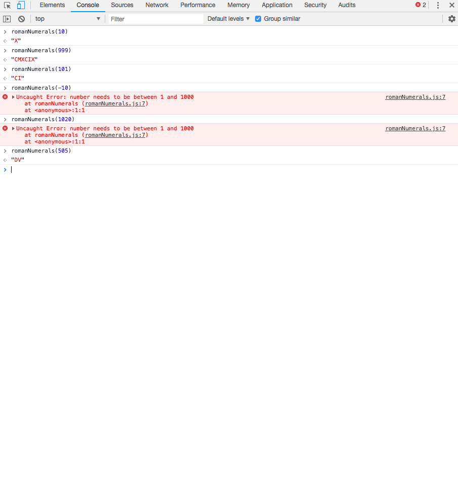

## Roman Numerals
A simple Kata challenge written in JavaScript to convert numbers from 1 to 1000 into roman numerals.
eg. 1 => I  
    10 => X
    999 => CMXCIX

Known issues:
- when user inputs values with 0s at the front it will not work eg 0012. A solution with the code is to remove the 0's before the checks are done.


## Launch and Test
  clone repo
  `git clone https://github.com/dct-lau17/roman-numerals-js.git`

  run code on browser console using SpecRunner.html
  `open SpecRunner.html`

  open console cmd + alt + i (on Mac) to view tests and run application

### Commands
```
romanNumerals(10)
=> X
romanNumerals(321)
=> CCCXXI
```

### Example


